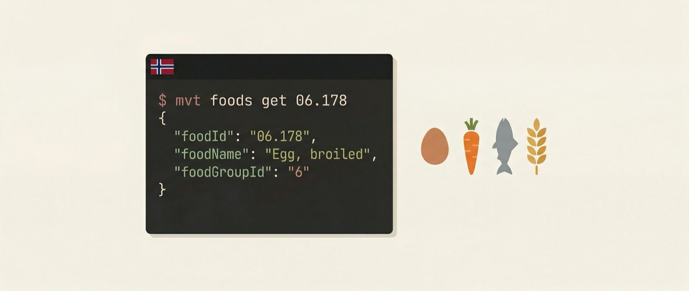

# mvt



[](https://github.com/alfredvc/matvaretabellen-cli/actions/workflows/ci.yml)
[](https://github.com/alfredvc/matvaretabellen-cli/releases)
[](LICENSE)


Agent-friendly Rust CLI for the Norwegian Food Composition Table ([matvaretabellen.no](https://www.matvaretabellen.no/api/)), run by Mattilsynet.

The entire upstream dataset (foods, food groups, nutrients, sources, langual codes, RDA profiles) is zstd-compressed and embedded in the binary — no network required at runtime. New upstream releases ship as new CLI releases.

## Install

```
curl -fsSL https://raw.githubusercontent.com/alfredvc/matvaretabellen-cli/main/install.sh | sh
```

Installs to `~/.local/bin/mvt`. Set `INSTALL_DIR` to override.

Alternatively via `cargo install matvaretabellen-cli` once published.

## Usage

All commands emit JSON to stdout (pretty-printed in a TTY, compact when piped or with `--json`). Errors go to stderr as `{"error": "..."}` with exit code 1.

### Global flags

| Flag | Default | Purpose |
|---|---|---|
| `--locale en|nb` | `en` (or `$MVT_LOCALE`) | Dataset locale |
| `--fields a,b,c.d` | — | Dotted field filter |
| `--json` | — | Force compact JSON |

### Commands

```
mvt foods list
mvt foods get <foodId>
mvt foods search <query> [--limit N]
mvt foods rda <foodId> [--profile <id>]

mvt food-groups list | get <id>
mvt nutrients  list | get <id>
mvt sources    list | get <id>
mvt langual    list | get <id>          # language-independent
mvt rda        list | get <id>

mvt describe [--check-upstream]         # schema + data version
mvt update [--check-only]               # self-update from GitHub releases
```

### Examples

```bash
# Adzuki beans in English
mvt foods get 06.178 --fields foodName,calories.quantity

# Search in Norwegian (diacritic-folded: "bonne" matches "bønne")
mvt --locale nb foods search bonne --limit 5 --fields foodId,foodName

# RDA coverage for iron in a food, against default profile
mvt foods rda 06.178 --fields coverage.nutrientId,coverage.percent | jq '.coverage[] | select(.nutrientId=="Fe")'

# Schema + version
mvt describe | jq .dataVersion
```

### Agent Skills

Install skills for AI coding agents (Claude Code, Cursor, Gemini CLI, etc.):

```bash
npx skills add alfredvc/matvaretabellen-cli
```

Installs workflow-oriented instruction files that teach agents how to use the CLI. Available skills:

- **mvt-shared** — output contract, locale flag, fields filter, resource list, offline guarantee.
- **mvt-food-lookup** — step-by-step workflow for looking up a food's nutrient content, browsing food groups, checking RDA coverage, mapping LanguaL codes.

See [AGENTS.md](AGENTS.md) for the command reference optimized for agents.

## Development

```bash
cargo fmt
cargo clippy --all-targets -- -D warnings
cargo test
```

Install pre-commit hook (fmt + test):

```bash
cat > .git/hooks/pre-commit <<'EOF'
#!/bin/sh
cargo fmt --check && cargo test 2>&1
EOF
chmod +x .git/hooks/pre-commit
```

Refresh the embedded dataset from upstream (run before tagging a new release):

```bash
./scripts/refresh-data.sh
```

This pulls fresh JSON from `matvaretabellen.no/api/` into `data/`, writes `data/VERSION` from the upstream `Last-Modified` header, and lets the next `cargo build` re-compress everything into the binary.

## License

MIT.
